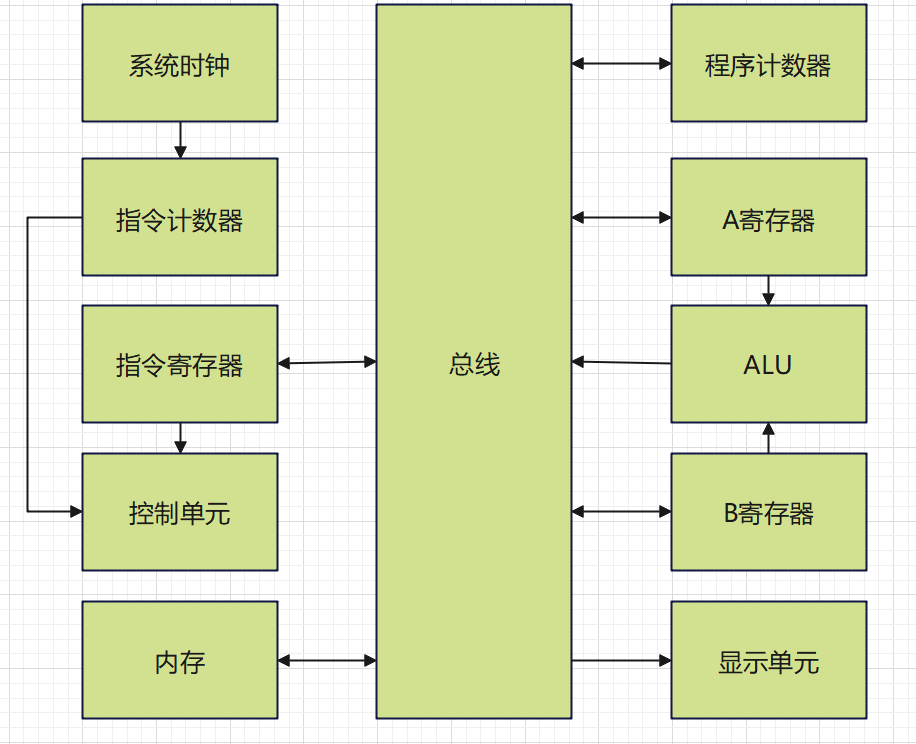

# 8_bit CPU with FPGA
## 简介
这个是一个用FPGA搭建的8位CPU，CPU内核主要由下图的模块组成。

上电后，用户可以通过拨码开关，在内存的不同地址写入机器码程序。程序写入完成后，可以通过启动时钟使得CPU开始工作。CPU启动后，系统时钟开始工作，给指令计数器时钟节拍。指令计数器给时钟节拍计数，生成微指令步数信息。控制单元收到指令计数器的信息后，会根据内部的指令集，译码为微指令，控制程序计数器，从内存加载用户写入的程序，读取到程序后，控制单元会根据读取到的程序，控制AB寄存器，ALU，显示单元，等其他模块，运行用户编写的程序。
## 演示视频
https://www.bilibili.com/video/BV14PxweuEP2
## 使用方法
### 1.编写汇编机器代码
CPU启动后，会从内存里读取程序数据并运行。内存里面有16个地址，每个地址可以存一个8位指令。每条指令的高四位是机器码，代表这条指令的行为；每条指令的低四位是这条指令的参数。开始运行程序后CPU会从内存地址0000开始运行程序，然后按顺序运行下一个内存地址的程序。直到碰到HLT停机指令为止。
目前支持的机器码指令如下：
``` 
机器码  汇编码   含义
0000     NOP    空等待
0001     LDA    把指令低四位作为指定内存地址的内容放入A寄存器
0010     ADD    把指令低四位作为指定内存地址的内容与A寄存器的数值相加，结果覆写A寄存器
0011     SUB    把指令低四位作为指定内存地址的内容与A寄存器的数值相减，结果覆写A寄存器
0100     STA    把A寄存器的内容存入指令低四位作为指定内存地址(目前暂不可用，还在修复)
0101     LDI    把指令低四位的内容放入A寄存器
0110     JMP    把指令低四位的内容作为程序下一次跳转到的地址
0111     JZ     ALU内容为0时跳转到指令低四位指向的内存地址，否则不工作
1000     JF     ALU内容为满时跳转到指令低四位指向的内存地址，否则不工作
1110     OUT    把A寄存器的结果存到输出寄存器
1111     HLT    停机
```
假如要让CPU运行计算1+2的结果的程序，并把结果显示到数码管上。可以在内存里写入下面的程序：
```
地址     汇编码       数据
0000:    LDA 1000    0001_1000	//往A寄存器写入内存地址为1000所在的数据
0001:	 ADD 1001    0010_1001	//加上内存地址为1001所在的数据，结果存入A寄存器
0010:	 OUT         1110_0000	//把A寄存器内容显示在数码管上
0011:	 HLT         1111_0000	//停机
0100:                0000_0000
0101:                0000_0000
0110:                0000_0000
0111:                0000_0000
1000:                0000_0001	//内存数据：1
1001:                0000_0010	//内存数据：2
1010:                0000_0000
1011:                0000_0000
1100:                0000_0000
1101:                0000_0000
1110:                0000_0000
1111:                0000_0000
```
CPU上电后，会从地址0000开始执行程序，地址0000存着LDA指令，此时CPU会往A寄存器写入内存地址为1000所在的数据，即数字1。地址0000的指令运行完毕后，CPU会开始运行地址0001的程序，地址0001存储着ADD指令，此时CPU会把刚才存到A寄存器的数值加上内存地址为1001所在的数据，即数字2，相加结果3存入A寄存器。地址0001的指令运行完毕后，CPU会开始运行地址0010的程序，地址0010存储着OUT指令，意味着CPU将会把刚才的相加结果3显示到数码管上。地址0010的指令运行完毕后，CPU会开始运行地址0011的程序，即停机代码，此时CPU的时钟将会被切断，代码停止运行。因此，运行完这个代码后可以看到数码管显示着1+2的结果，即为3。
下面是另一段程序，运行后，寄存器的变量将不断自增，并显示到数码管上，当变量达到255时，变量将不断自减，直到减到0，此时变量又会开始不断自增，循环往复。这段代码展示了CPU的跳转功能和条件跳转功能（类似于C语言的if语句）
```
地址     汇编码       数据
0000:    OUT         1110_0000	//把A寄存器内容显示在数码管上
0001:	 ADD 1000    0010_1000	//把A寄存器数据加上内存地址为1000所在的数据，结果存入A寄存器
0010:	 JF  0100    1000_0100	//如果ALU内容为满时跳转到地址0110继续运行
0011:	 JMP 0000    0110_0000	//跳转到地址0000继续运行
0100:    SUB 1001    0011_1001  //把A寄存器数据减去内存地址为1001所在的数据，结果存入A寄存器
0101:    OUT         1110_0000  //把A寄存器内容显示在数码管上
0110:    JZ  0000    0111_0000  //如果ALU内容为空时跳转到地址0000继续运行
0111:    JMP 0100    0110_0100  //跳转到地址0100继续运行
1000:                0000_0001	//内存数据：1
1001:                0000_0001	//内存数据：1
1010:                0000_0000
1011:                0000_0000
1100:                0000_0000
1101:                0000_0000
1110:                0000_0000
1111:                0000_0000
```
### 2.写入代码
给FPGA上电后，把SW35，即时钟源切换的开关拨到上面后，可以将CPU的时钟源调整为手动时钟模式，此时CPU的时钟不会自动运行，只有当SW1被按下后，才能给CPU一个时钟脉冲。
接着，把SW31，即内存地址模式的开关拨到下面，可以把内存的地址输入切换到手动模式，此时内存的手动模式指示灯亮起，自动模式的指示灯熄灭。此时内存的地址和数据将完全由拨码开关来控制，就可以通过拨码开关来手动往内存里面写入数据。
要往内存的某个地址写入特定的数据，首先需要通过拨码开关SW36设置内存地址，设置完内存地址后，可以通过拨码开关SW32设置对应地址的内存数据。然后触摸开发板右下角的触摸按键，即可把当前设置的内存数据写入当前的内存地址。此时可以查看表示内存数据的8个LED来确认内存地址是否写入正确。例如我要把内存的地址4’b0000的位置写入数据8'b00011000，需要先把设置地址的拨码开关拨到0000，然后把设置数据的拨码开关拨到00000001，最后再触摸开发板右下角的触摸按键，即可完成写入。重复上述过程，即可把数据写道内存里。
### 3.运行代码
把SW31，即内存地址模式的开关拨到上面，可以把内存的地址输入切换到自动模式，此时内存的手动模式指示灯熄灭，自动模式的指示灯亮起。意味着此时内存地址将不再受拨码开关的控制，而是在CPU运行时，由控制单元自动设置。
把SW35，即时钟源切换的开关拨到下面后，可以将CPU的时钟源调整为自动时钟模式，此时CPU将获得时钟模块的时钟脉冲，代码开始运行。如果之前往内存里写入的是计算1+2的结果的程序，那么过一段时间等程序运行结束，所有LED不再闪烁后(时钟指示灯除外)，数码管将会稳定显示运行结果即数字3.

## 制作方法
使用嘉立创工程的Board3直接打板即可，大部分原件来自嘉立创基础库，在有券的情况下做SMT，只贴基础库的元件，可以免去工程费和换料费。剩下的扩展库的元件可以手工焊接。然后把焊接好的扩展板按照视频内容插入到正点原子达芬奇FPGA开发板上(不是达芬奇PRO开发板)，最后通过Vivado分析综合生成比特流后，写入到开发板即可。
## 注意事项
1.制作pcb时要选择pcb工程的Board3进行打板，Board3是最新版本的pcb
2.代码附带仿真文件，并且有ila。但是，在观察仿真文件和ila波形时需要更改时钟模块的频率，才能看到较好的效果。通过注释或者解注释不同的代码片段，来调整不同的时钟频率，观察不同效果。
``` Verilog
    // clock.v 第42行
    // else if (cnt<24'd4) begin//ila
    // else if (cnt<24'd100) begin//仿真
    else if (cnt<28'd1000_0000) begin//实际
```
``` Verilog
    // clock.v 第54行
    // else if(cnt<24'd2)//ila
    // else if(cnt<24'd50)//仿真
    else if (cnt<28'd500_0000)//实际
```
3.CPU的架构和指令集设计思路来自 https://www.youtube.com/@BenEater 
在B站 https://space.bilibili.com/413461202 可以找到中文翻译的版本